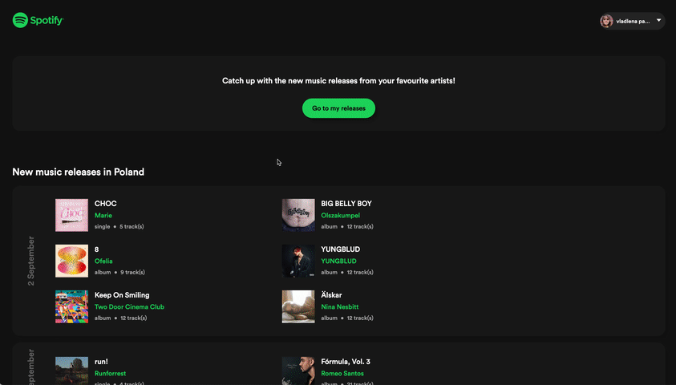

# [Spotify Releaser](https://spotify-releaser.vercel.app/) - never miss new music!

Track new releases from your favourite artists on Spotify. Get a list of new albums and singles of artists or songs you've liked on Spotify, filter releases by type and get as far back as last year!

> **Please reach out to me if you'd like to use the app - at the moment it is under a strict limit of 25 users according to the Spotify Developer Policy.**

## 🔗 Deployed version

On Vercel - **[Spotify Releaser](https://spotify-releaser.vercel.app/)**

## 🧰 Stack and tools

- **[Remix](https://remix.run/)** with **TypeScript**: full stack web framework
- **[Spotify Web API](https://developer.spotify.com/documentation/web-api/)**: releases and user data
- **[Prettier](https://prettier.io/docs/en/index.html)** + **[eslint](https://eslint.org/)**: formatting
- **[styled-components](https://styled-components.com/)**: styling
- **[Vercel](https://vercel.com/)**: deployment.

## ✨ What to expect next

- [x] Like interesting releases to add it to your Spotify library (v.1.1.0)
- [x] Add releases to an existing playlist from your profile (v.1.1.0)
- [x] Choose your region on starting page (v.1.2.0)
- [x] Get new releases from your liked songs, not only artists (v.1.2.0, but **very** unstable)
- [ ] Create new playlists with selected releases
- [ ] "Infinite" scrolling feed
- [ ] Custom period to get new releases for.
